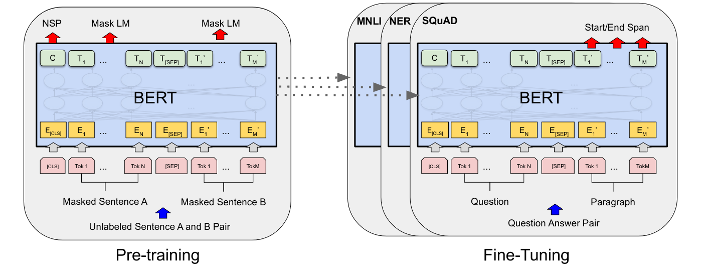
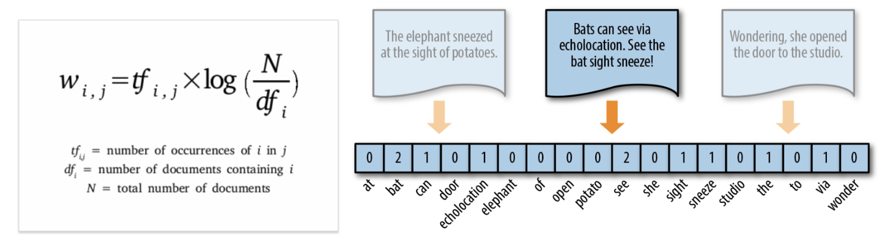
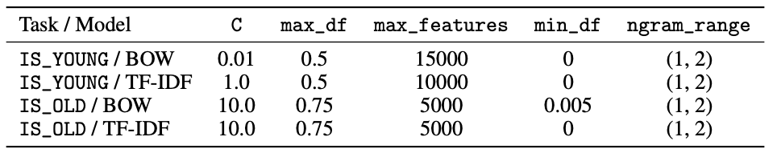
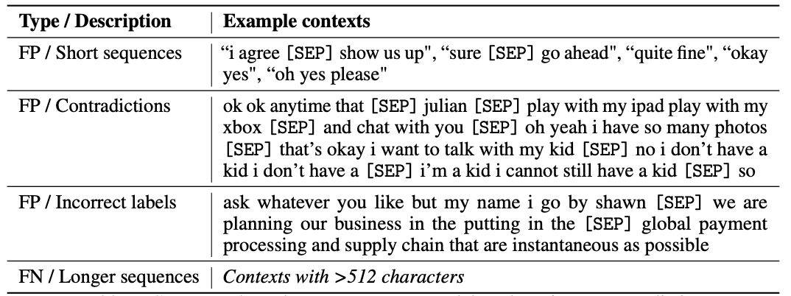
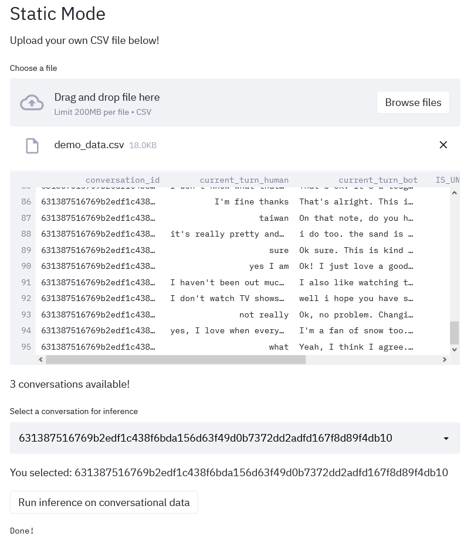
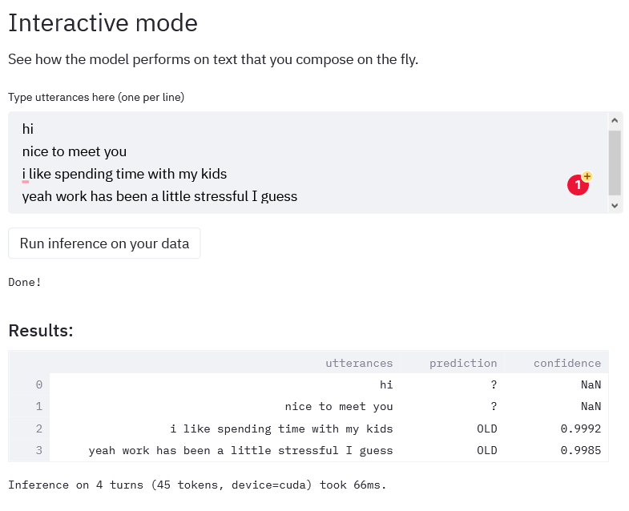

# Don't Kid Yourself: Turn-by-Turn Age Group ID From Conversational Data

**Team members:** Trenton Chang, Caleb Chiam, Avanika Narayan

# The Problem

Open-domain AI conversation is an unsolved task in natural language processing. Despite huge breakthroughs like Xiaoice, Meena, and Stanford’s own Chirpy Cardinal, we still have a long way to go before we achieve human-like conversation [1, 2, 3].

One particular challenge inherent in open-domain conversations is its subjectivity: different users want to talk about different things, or might prefer different styles of conversation. This means that personalizing the user’s experience in a conversation is important. Although we can’t infer every single fact about a particular user, we can focus on an important subproblem: age group classification. This task is relevant because of age differences in human conversational interests: for example, younger users may be more inclined to discuss schoolwork, but older users may be more interested in discussing their children or career. Our interest is in automating age classification towards this end.

Further complicating this task is the need for turn-by-turn predictions. For live conversational AI systems, it’s not very useful to know after-the-fact what the user’s age group was. Instead, we’d  like to get some sense of the user’s age group during the conversation itself, gathering information about the user as the conversation progresses, so that the system can react during the conversation and adjust its conversational style or topics accordingly. To our knowledge, this is the first system that explores *turn-level* user attribute prediction that can be used for inference live during real-time human-AI conversations.

# System Description

Our system is a machine-learning powered web interface that lets developers access our powerful, in-house models trained on *real-world conversational* data to perform fine-grained error and instance-level analysis. Currently, due to privacy and legal concerns, access is limited to members of the Alexa Prize Team at Stanford, since we work directly with raw conversational logs from Alexa devices across millions of users in the U.S. 

The core of our front-end is a Streamlit-based wrapper with two modes of usage, each targeting a different use case: 1) static mode and 2) interactive mode, which we outline in the Demonstration section. The general input-output behavior is identical in both modes: the user inputs some conversational data, and then passes the input to our backend, which we discuss here. 

The backend operates on the input conversational data in two phases: 1) an ML-powered phase and 2) an out-of-distribution filtering phase. The first ML-powered step is based on two BERT-based transformer models for binary sequence classification: one for classifying young users, and one for classifying old users. This is similar to the one-versus-rest setup, and allows us to abstain from making predictions in unconfident regions. These models each take in a particular conversation, and output turn-level predictions as follows: For each conversational turn, the input conversation is passed to both models, who output turn-by-turn predictions for the conversation. Internally, for each sentence, the model predicts each age group attribute based on what the human has said up to the current turn. More details about the particular modeling choices and the inference setup are provided later in this post.

These model predictions are then passed to an out-of-distribution detector which works as follows [5]. In cases where both models return a negative prediction, or contradict one another, we mark this situation as “unknown,” and output this result to the user. Alternately, using maximum-softmax probability based methods, if the model prediction falls below a certain confidence threshold, we also mark it as unknown. These failure modes most often occur at the beginning of  the conversation, when the user’s entire conversational history comprises a greeting and their name.

**Static mode.** In static mode, the user already has a preset CSV file containing conversational logs. This mode is most useful if the user wants to glean age information about a preset sample of users from their conversational data. We outline the format of the file below in our demonstration. This mode takes as input a CSV file of conversational information, and outputs a printout of model predictions and confidence scores on each turn of the data.

As a toy example, one might upload something of the form

| **ID** | **Human** | **Bot** |
| ---- | ---- | ---- |
| 1 | hi | Hello! How are you today? |
| 1 | i went to school | That sounds fun! What did you do? | 
| 1 | i studied math and had a lot of work | Oh, I’m sorry to hear that. |
| 2 | hi | Hello! How are you today? |
| 2| i’m alright thanks what about you | I’m good, thanks for asking! Hey, if you don’t mind me asking, what’s your favorite dish? | 
| 2 | excuse me what? | Yeah, what do you like to eat? | 
| 2 | I guess uh fish tacos uh are pretty good | I love fish tacos as well! | 

The above table shows two conversations with ID 1 and 2. Conversation 1 features the user talking about school; conversation 2 features the user talking [hesitantly] about fish tacos. This is then passed to the backend, from which a printout about the model predictions, model confidence, and latency is obtained.

**Interactive mode.** In this mode, the user can type arbitrary sentences representing an imaginary conversation, in order to more narrowly probe hypothetical situations in conversational data. This can give a user signal as to whether strong age-related information can be extracted from a given conversational setting. The form of the output is the same as above.

# Our ML-Powered Approach

## Data collection and processing

We use two data streams that we pulled from our internal Alexa Prize conversational logs:
* a small **gold-labeled** set of 7426 conversational turns over 270 conversations. For each conversational turn, we output whether we believe each context is from a young or old user, or unknown, based on that turn (and the turns before it).
* a **weakly-supervised** set of 102252 turns over 1854 conversations. These are scraped programmatically using manually identified phrases associated with age, such as “mommy”, “daddy”, “my kids”, “schoolwork” -- taking care to include both gendered and gender-neutral terminology. We also scrape instances of “years old”, where the user explicitly makes an age disclosure. Conversational turns prior to the age-identifying phrase are labeled as unknown, while all turns including and after the phrase are labeled with the corresponding age group label.

From these sets of data, we construct weakly-supervised and gold-labeled subsets for training and evaluation. These subsets are engineered to be balanced in the number of positive and negative conversations and conversational turns, with steps taken to prevent data leakage between splits. We do a stratified 70-15-15 train-val-test split.

## Modeling

**Fig. 1:** Schematic of BERT architecture, which we use for our sequence classification models.

**BERT.** We finetune a BERT [4] model for sequence classification, specifically `bert-base-uncased.` We use the SimpleTransformer library to initialize the model in a wrapper that allows for sliding window predictions, where, if the input exceeds the BERT model token limit, it is split into multiple windows and predictions are computed separately for each window and then aggregated into an overall label. To find optimal hyperparameters, we run a sweep configuration using Weights & Biases.

**Fig. 2:** Formula for TF-IDF (left) and visualization of count vectorization (right), alternative word featurization techniques that we try.

**Logistic regression baselines.** To benchmark the performance of our fine-tuned BERT models, we present two baselines, a TF-IDF logistic regression model and a bag-of-words logistic regression model. We use L2 regularization and choose the best hyperparameters using grid search.

## Evaluation

**Table 1:** Evaluation of BERT model and baselines on test split and gold dataset. Although there is a gap between our gold-labeled and weakly-supervised performance, we still achieve promising results using BOW for the `IS_YOUNG` model and BERT for the `IS_OLD` model.

We evaluate the accuracy and F1 score of the BERT models and baselines on the test split and gold datasets. We find that all models perform well on the test split of the data, but do not generalize as well to the gold dataset. That the baselines perform particularly well on the test split is unsurprising given thatthe positive examples in the weakly supervised data have been identified based on the presence ofspecific key phrases. Thus, a logistic regression model that weights these phrases highly would beable to make predictions with very high accuracy. However, it is noteworthy that, for the `IS_OLD` task, the BERT model achieves the highest F1 score on the gold dataset and an accuracy score that is very slightly worse than the best-performing TF-IDF model. This suggests that BERT has picked up on useful signals beyond simple phrase detection (see Table 2 for a few examples.) For the `IS_YOUNG` task, however, BERT performs poorly with a low F1 score stemming from its high false negative rate, and BOW achieves the best performance by far.

**Table 2:** Contexts where the BERT model correctly predicts the label on the `IS_OLD` task while the logistic regression models do not.

### Differences in `IS_YOUNG` and `IS_OLD` task difficulty 
For the `IS_YOUNG` task, we find that the low F1 scores of BERT and TF-IDF are due to their high false negative rates. This suggests that there are useful signals of a young user's age that the model is not currently able to pick up on, resulting in a false negative. We hypothesize that the disparity in performance between the `IS_OLD` and `IS_YOUNG` tasks may be due to inherent differences in difficulty. 

Specifically, the ways in which an annotator might identify a user as someone who is young are more varied -- the user's choice of favorite foods, TV shows, and movies may make it apparent that the user is not old, while the converse is less likely to occur, i.e. there are fewer activities or likes that could not be shared by a younger user. For example, a user whose favorite movie is _Casablanca_ may be an older user or a teenage film buff. This inherent difficulty for human annotators in identifying older users except by explicit cues (such as indications of parenthood or a working career) translates to a gold dataset for `IS_OLD` consisting primarily of examples that are easier for machine learning models to identify, and consequently `IS_OLD` is easier for the models to perform well on. This interpretation is supported by the fact that the best-performing hyperparameters for the baseline models in the `IS_OLD` task have the maximum number of n-gram features set at 5000, while the `IS_YOUNG` task models have it set at 10000 or 15000 (see Table 3).

**Table 3:** Best-performing hyperparameters for the logistic regression model

### Qualitative inspection of BERT model failures

**Table 4:** Contexts where the `IS_OLD` BERT model made an incorrect prediction

As shown in Table 4, we find that the `IS_OLD` BERT model has a tendency of producing false positives for some short sequences. This may perhaps be explained by some of the phrases beingmore commonly used by adults than younger users, such as 'i agree', 'sure', 'quite fine'. We also find that the model defaults to positive predictions when it encounters contradictions. Note that the example in Table 4 probably reflects a failure in transcription as well, i.e. the user likely said something that was mistranscribed as “i want to talk with my kid". 

In some cases, ostensibly incorrect predictions turn out to be errors in our weakly supervised labels, and the BERT model correctly infers that the user is an older user. Finally, for the model’s false negatives,we were not able to find consistent patterns in the model’s prediction errors, but did find that they allinvolved longer sequences (i.e. contexts with more than 500 characters).

# Demonstration

We provide a brief overview of static mode and interactive mode with screenshots of example use cases.

Static mode. The user can upload a CSV file where each line is a conversational turn, with a unique identifier, and pass it for turn-by-turn inference as well as a report on total latency. This is useful if a user wants to learn more about their clients from past conversational data. We continue with the example from the System Description section: 

| **ID** | **Human** | **Bot** |
| ---- | ---- | ---- |
| 1 | hi | Hello! How are you today? |
| 1 | i went to school | That sounds fun! What did you do? | 
| 1 | i studied math and had a lot of work | Oh, I’m sorry to hear that. |
| 2 | hi | Hello! How are you today? |
| 2| i’m alright thanks what about you | I’m good, thanks for asking! Hey, if you don’t mind me asking, what’s your favorite dish? | 
| 2 | excuse me what? | Yeah, what do you like to eat? | 
| 2 | I guess uh fish tacos uh are pretty good | I love fish tacos as well! | 

The above table shows two conversations with ID 1 and 2. Conversation 1 features someone talking about school; conversation 2 features another individual talking hesitantly about fish tacos. Then, the user can select a conversation (either 1 or 2) from a drop-down menu, and click on the “Run inference on conversational data” button. At this point, the application will automatically extract the data from the column with the human text, and give you your predictions as well as the total latency, giving us a printout of the form seen in the System Description section.

| **Human** | **Prediction** | **Confidence** |
| ---- | ---- | ---- |
| hi | ? | NaN | 
| i went to school | YOUNG | 0.9000 |
| i studied math and had a lot of work | YOUNG | 0.8985 |

`Inference (16 tokens, device=cuda) took 88ms.`

This shows a printout of turn-by-turn model predictions and confidence scores, as well as a final report on the latency for all predictions. In this toy example, after saying “hi,” the model is uncertain, as denoted by the “?” in the Prediction column and the “NaN” in the Confidence column. This is expected. Then, once the user mentions “school,” in subsequent turns the user is classified as `YOUNG` with high confidence, as needed.

Interactive mode. This mode allows the user to interactively type sentences for live prediction. This is useful for getting estimates of client age group in hypothetical situations that one might expect to encounter in the wild. To use this mode, the user can simply type each sentence that a user might say on a new line, and then run inference by clicking on the “Run inference on conversational data” button. As with static mode, this will output turn-by-turn predictions as well as the total latency. The output takes on the exact same form as static mode.

**Fig. 3:** A screenshot of static mode, featuring a preview of conversational data. The user can run inference on this conversation by clicking on “Run inference on conversational data.”

**Fig. 4:** A screenshot of interactive mode, featuring a printout of model predictions as well as the interactive text input area.

# Post-Mortem

**Quality and quantity in data-labeling.** One of the early challenges that we faced was acquiring a sizable labeled dataset. Our first approach was to hand label several conversations from the Alexa Prize competition. However, this proved to be very inefficient and we were only able to accumulate on the order of 7,000 labeled samples. Thus, we transitioned to a “weakly supervised” approach (as described above) that enabled us to construct a much larger dataset. Moving forward, we intend to improve upon our weakly supervised data collection processes by using tools such as Snorkel that would enable us to embed a more heuristics driven approach to our labeling process. We would also expand our existing set of regexes to be more comprehensive.

**Modeling improvements.** We had considered the possibility of pre-training then fine-tuning a dialog model that incorporates both human and bot utterances, but chose the more straightforward BERT fine-tuning approach given the limited time we had and the large amount of time required to pre-train a model. We acknowledge that the BERT fine-tuning approach is necessarily incomplete as it is unable to contextualize the user’s utterances with respect to the bot’s prompts and questions, and would opt for the dialog model paradigm given more time to work on this.

Given a greater volume of data, we would also have sampled some _k_ utterances from each conversation when constructing the datasets, instead of including the entirety of the conversation in datasets. We realized only later on in the project that including the entirety of the conversation translated to some long conversations having an outsized influence in model learning, which likely resulted in less robust model performance.

**UI/UX design considerations.** With regards to application design, the team opted to use Streamlit for production. This is a natural choice due to its simplicity and seamless integration with Python machine learning modules, and allows both technical and non-technical practitioners to dynamically glean age-related information from conversational data through our system. We envision expanding our application to include a “playground” like interface where machine learning engineers can fine-tune our age-classification modules to their specific use cases and use the interface and thus better understand the performance of their own modules. In other words, they would be able to explore edge cases and visualize regions of the sample space in which their fine-tuned model performed poorly on. Access to such an interface would allow for faster retraining and model iteration loops.

# Broader Impacts

**Societal prejudice.** To mitigate the impact of societal bias in our labels, for our weakly-supervised key phrases, whenever we used a gendered phrase to scrape data, we used both gendered and gender-neutral counterparts as well (i.e. “my husband,” “my wife,” “my partner”). This helps ensure appropriate coverage for our weakly-supervised dataset across various societal lines. Further work is necessary to ensure that as we expand weakly-supervised labeling, that we use culturally sensitive and inclusive terminology so that our system performs equitably across all groups.

**User privacy and agency.** Personalization is particularly relevant to user privacy; by definition, personalization requires inferring user information. Thus, by design, we do not infer the user’s exact age; only a general age group (young vs. old). These categories are left intentionally vague while still having sufficient predictive power, in order to balance utility to a practitioner designing an ML system that uses age information while preserving user privacy. We further do not cache or store any inputs to our model; our UI is entirely memoryless with respect to particular user inputs to avoid even the perception of mishandling user data. 

**Intended and unintended use cases.** We find it important to warn that ML systems using our model as an upstream module ought to be aware of the potential downstream impacts. This system is an early-stage project and it is still limited; we attempt to mitigate the potential harms from relying unconditionally on model predictions by abstaining from outputting unconfident predictions. This does not preclude the possibility of confidently wrong predictions, which can either happen as a limitation of our model or from a malicious actor; the latter topic is well-explored in adversarial machine learning. We stress that even with an age classifier achieving perfect accuracy, using such personalization systems to make life-altering decisions on human subjects is **far outside the intended use of our algorithm;** our intent is that this system be used for conversational AI purposes *only,* within systems that do not affect human safety, freedom, or governance.

## Contributions

- Avanika handled `IS_YOUNG` model training and building a docker container for the application. 
- Caleb handled data preprocessing / dataset construction, and built the pipelines for training and evaluating the BERT models (integrated with Weights & Biases) and the baseline TF-IDF and BOW logistic regression models. He also handled `IS_OLD` model training.
- Trenton built the data scraping and transformation pipeline, including the weakly-supervised data labeling pipeline. He also proposed and implemented the out-of-distribution detection scheme. He also designed and created the model UI.

## References 
[1] Li Zhou, Jianfeng Gao, Di Li, and Heung-Yeung Shum.  The design and implementation of xiaoice, an empathetic social chatbot, 2019.

[2] Daniel Adiwardana, Minh-Thang Luong, David R. So, Jamie Hall, Noah Fiedel, Romal Thoppi-lan, Zi Yang, Apoorv Kulshreshtha, Gaurav Nemade, Yifeng Lu, and Quoc V. Le. Towards a human-like open-domain chatbot, 2020.

[3] Ashwin  Paranjape,  Abigail  See,  Kathleen  Kenealy,  Haojun  Li,  Amelia  Hardy,  Peng  Qi,  Kaushik Ram Sadagopan, Nguyet Minh Phu, Dilara Soylu, and Christopher D. Manning. Neural generation meets real people: Towards emotionally engaging mixed-initiative conversations, 2020.

[4] Jacob Devlin, Ming-Wei Chang, Kenton Lee, and Kristina Toutanova.  Bert: Pre-training ofdeep bidirectional transformers for language understanding.arXiv preprint arXiv:1810.04805,2018.

[5] Dan Hendrycks and Kevin Gimpel. A baseline for detecting misclassified and out-of-distributionexamples in neural networks, 2018.

